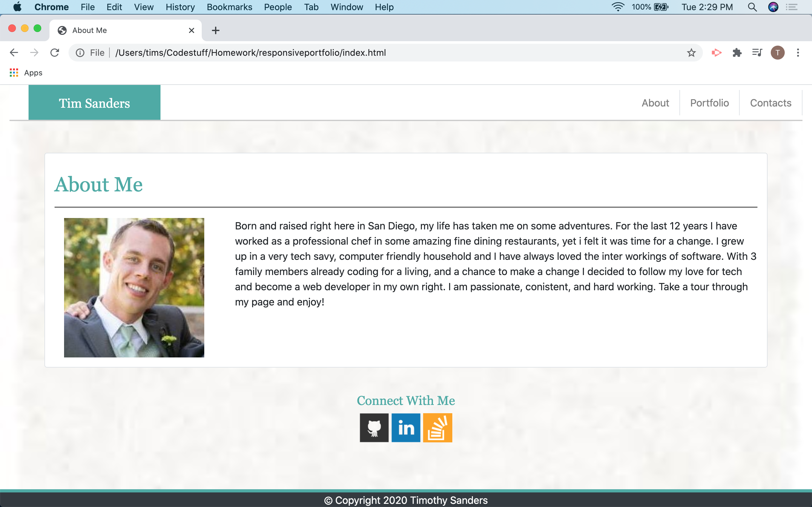

# My Portfolio #

## Descrption ##

This repository was created to highlight some of my work, access my social media accounts, and contact me with any questions or possible career opportunities. There are three pages to my portfolio, the first is an introduction to myself and a small bit of background information. There is a section that has projects I will be working on through my studies and beyond. Finally there is a contact page that will soon be implemented with the means to send me an email.

## Resources ##

[BootStrap 4.4](https://getbootstrap.com)
[Stack Overflow](https://stackoverflow.com/)
My Wonderful Study Group

