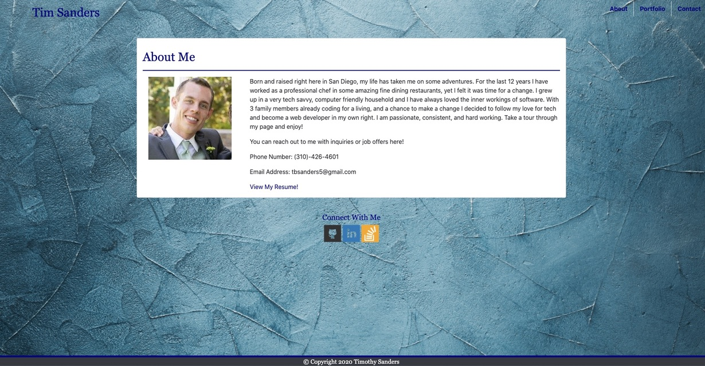

# My Portfolio #

## Descrption ##

This repository was created to highlight some of my work, access my social media accounts, and contact me with any questions or possible career opportunities. There are three pages to my portfolio, the first is an introduction to myself and a small bit of background information. There is a section that has projects I will be working on through my studies and beyond. Finally there is a contact page that will soon be implemented with the means to send me an email.

## Resources ##

* [BootStrap 4.4](https://getbootstrap.com)
* [Stack Overflow](https://stackoverflow.com/)
* [FreePik](https://www.freepik.com/photos/background)
* My Wonderful Study Group

### Explore ###

* [About Me](https://tbsanders5.github.io/responsiveportfolio/index.html)
* [My Portfolio](https://tbsanders5.github.io/responsiveportfolio/portfolio.html)
* [Contact Me](https://tbsanders5.github.io/responsiveportfolio/contacts.html)

---
Copyright (c) 2020 Sanders, Timothy

Permission is hereby granted, free of charge, to any person obtaining a copy
of this software and associated documentation files (the "Software"), to deal
in the Software without restriction, including without limitation the rights
to use, copy, modify, merge, publish, distribute, sublicense, and/or sell
copies of the Software, and to permit persons to whom the Software is
furnished to do so, subject to the following conditions:

The above copyright notice and this permission notice shall be included in all
copies or substantial portions of the Software.

THE SOFTWARE IS PROVIDED "AS IS", WITHOUT WARRANTY OF ANY KIND, EXPRESS OR
IMPLIED, INCLUDING BUT NOT LIMITED TO THE WARRANTIES OF MERCHANTABILITY,
FITNESS FOR A PARTICULAR PURPOSE AND NONINFRINGEMENT. IN NO EVENT SHALL THE
AUTHORS OR COPYRIGHT HOLDERS BE LIABLE FOR ANY CLAIM, DAMAGES OR OTHER
LIABILITY, WHETHER IN AN ACTION OF CONTRACT, TORT OR OTHERWISE, ARISING FROM,
OUT OF OR IN CONNECTION WITH THE SOFTWARE OR THE USE OR OTHER DEALINGS IN THE
SOFTWARE.